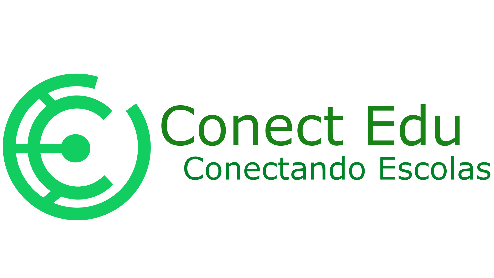

# 🎓 ConectEdu - Plataforma de Conexão Educacional

<div align="center">



**Conectando empresas doadoras a escolas públicas através da tecnologia**

[](https://reactjs.org/)
[](https://supabase.com/)
[](https://nodejs.org/)
[](LICENSE)

</div>

---

## 📋 Sobre o Projeto

O **ConectEdu** é uma plataforma web desenvolvida com o objetivo de reduzir a desigualdade digital na educação brasileira. A aplicação conecta empresas e pessoas físicas doadoras a escolas públicas, facilitando a doação de equipamentos eletrônicos e gerando documentação oficial necessária para o processo.

### 🎯 Objetivos

- **Democratizar o acesso à tecnologia** nas escolas públicas
- **Facilitar doações** de equipamentos eletrônicos
- **Gerar documentação oficial** (termos, declarações e recibos) em formato PDF
- **Promover sustentabilidade** através da reutilização de equipamentos
- **Garantir transparência** no processo de doação

---

## ✨ Funcionalidades Principais

### 🔐 Sistema de Autenticação
- Registro e login de usuários
- Recuperação de senha
- Autenticação via Supabase Auth
- Proteção de rotas com middleware
- Perfil de usuário personalizado

### 📄 Geração de Documentos PDF
- **Termo de Doação**: Documento oficial para doação de equipamentos
- **Declaração de Doação**: Declaração formal de doação
- **Recibo de Doação**: Recibos para pessoa física e jurídica
- Geração automática de PDFs com formatação ABNT
- Preview em tempo real antes da geração
- Histórico de documentos gerados

### 📊 Dashboard do Usuário
- Visualização e gerenciamento de perfil
- Alteração de senha
- Pesquisa de instituições de ensino cadastradas
- Histórico de documentos gerados
- Acesso rápido para gerar novos documentos
- Informações sobre o processo de doação

### ♻️ Hub de Reciclagem
- Informações sobre descarte adequado
- Parceiros de reciclagem
- Orientações sobre logística reversa

### 📱 Design Responsivo
- Interface adaptável para desktop e mobile
- Experiência otimizada para diferentes dispositivos
- Acessibilidade com VLibras integrado

---

## 🛠️ Tecnologias Utilizadas

### Frontend
- **React.js 18.3.1** - Biblioteca para construção de interfaces
- **React Router 6.29.0** - Roteamento de páginas
- **Bootstrap 5.3.3** - Framework CSS
- **Tailwind CSS 3.4.17** - Framework CSS utility-first
- **Framer Motion 12.6.2** - Animações
- **React Icons 5.5.0** - Ícones

### Backend & Banco de Dados
- **Supabase 2.52.0** - Backend as a Service (BaaS)
  - PostgreSQL como banco de dados
  - Autenticação e autorização
  - Storage para arquivos
  - Real-time subscriptions

### Geração de PDF
- **jsPDF 3.0.1** - Geração de documentos PDF
- **html2canvas** - Conversão de HTML para imagem
- **@react-pdf/renderer 4.3.0** - Renderização de PDFs em React

### Ferramentas de Desenvolvimento
- **React Scripts 5.0.1** - Ferramentas de build
- **ESLint** - Linter para JavaScript
- **Webpack** - Bundler de módulos

---

## 🚀 Como Executar o Projeto

### Pré-requisitos

- Node.js (versão 14 ou superior)
- npm ou yarn
- Conta no Supabase (para configuração do backend)

### Instalação

1. **Clone o repositório**
```bash
git clone https://github.com/seu-usuario/projeto-icvreact.git
cd projeto-icvreact
```

2. **Instale as dependências**
```bash
npm install
```

3. **Configure as variáveis de ambiente**

Crie um arquivo `.env` na raiz do projeto com as seguintes variáveis:

```env
REACT_APP_SUPABASE_URL=https://seu-projeto.supabase.co
REACT_APP_SUPABASE_ANON_KEY=sua_chave_anonima_do_supabase
REACT_APP_SITE_URL=http://localhost:3000
```

**Nota:** O projeto funciona sem o arquivo `.env` usando valores padrão, mas é recomendado configurar suas próprias credenciais para produção.

Para obter as credenciais do Supabase:
1. Acesse [app.supabase.com](https://app.supabase.com)
2. Crie um novo projeto ou selecione um existente
3. Vá em Settings > API
4. Copie a URL do projeto e a chave `anon` (public)

4. **Inicie o servidor de desenvolvimento**
```bash
npm start
```

O projeto estará disponível em `http://localhost:3000`

### Build para Produção

```bash
npm run build
```

Isso criará uma pasta `build` com os arquivos otimizados para produção.

---

## 📁 Estrutura do Projeto

```
projeto-icvreact/
├── public/                 # Arquivos estáticos
│   ├── index.html
│   └── manifest.json
├── src/
│   ├── assets/            # Imagens e recursos estáticos
│   │   └── img/
│   ├── components/        # Componentes React reutilizáveis
│   │   ├── ManualReportPreview.js
│   │   ├── ManualReportForm.js
│   │   ├── AuthMiddleware.js
│   │   ├── ProtectedRoute.js
│   │   └── ...
│   ├── pages/             # Páginas da aplicação
│   │   ├── Login.jsx
│   │   ├── Register.jsx
│   │   ├── userDashboard.jsx
│   │   ├── generateReport.jsx
│   │   └── ...
│   ├── hooks/             # Custom hooks
│   │   └── useAuth.js
│   ├── config/            # Arquivos de configuração
│   ├── App.js             # Componente principal
│   ├── App.css
│   ├── index.js           # Ponto de entrada
│   └── supabaseClient.js  # Cliente Supabase
├── package.json
└── README.md
```

---

## 🎨 Principais Componentes

### ManualReportPreview
Componente responsável pela visualização e geração de PDFs. Implementa:
- Preview em tempo real dos documentos
- Geração de PDF com formatação ABNT
- Suporte para múltiplos tipos de documentos
- Responsividade para mobile e desktop

### ManualReportForm
Formulário dinâmico para preenchimento de dados dos documentos, com validação e feedback visual.

### AuthMiddleware
Middleware de autenticação que protege rotas e gerencia sessões de usuário.

---

## 🔒 Segurança

- Autenticação via Supabase Auth com PKCE flow
- Proteção de rotas sensíveis
- Validação de dados no frontend e backend
- Armazenamento seguro de tokens
- HTTPS obrigatório em produção

---

## 📝 Tipos de Documentos Suportados

1. **Termo de Doação**
   - Para empresas e pessoas físicas
   - Inclui cláusulas sobre natureza, responsabilidade e descarte

2. **Declaração de Doação**
   - Declaração formal de doação
   - Inclui informações do doador e donatário

3. **Recibo de Doação**
   - Recibo 1: Para pessoa jurídica
   - Recibo 2: Para pessoa física

---

## 🌐 Deploy

O projeto está configurado para deploy na **Vercel**. O arquivo `vercel.json` contém as configurações necessárias.

Para fazer deploy:

1. Conecte seu repositório à Vercel
2. Configure as variáveis de ambiente
3. Faça o deploy automático

---

## 🤝 Contribuindo

Contribuições são bem-vindas! Para contribuir:

1. Faça um fork do projeto
2. Crie uma branch para sua feature (`git checkout -b feature/AmazingFeature`)
3. Commit suas mudanças (`git commit -m 'Add some AmazingFeature'`)
4. Push para a branch (`git push origin feature/AmazingFeature`)
5. Abra um Pull Request

---

## 📄 Licença

Este projeto está sob a licença ISC. Veja o arquivo `LICENSE` para mais detalhes.

---

## 👥 Autores

- **Guilherme Grasso Teixeira Xeres** - Desenvolvimento e implementação
  - GitHub: [@seu-usuario-github](https://github.com/gtx-Gui/ConectEdu) 
  - LinkedIn: [Guilherme Grasso](https://www.linkedin.com/in/guilherme-grasso-teixeira-xeres-639380302?lipi=urn%3Ali%3Apage%3Ad_flagship3_profile_view_base_contact_details%3BUAG%2F6RsqSFujAXZHT1%2FG5Q%3D%3D) 
  - Email: conectedu.org@gmail.com

---

## 🙏 Agradecimentos

- Supabase pela infraestrutura de backend
- Comunidade React pelo ecossistema incrível
- Todas as bibliotecas open-source utilizadas

---

## 📞 Contato

Para mais informações sobre o projeto, visite:
- Website: [ConectEdu](https://conectedu.vercel.app)
- Email: conectedu.org@gmail.com

---

<div align="center">

**Desenvolvido com ❤️ para transformar a educação brasileira**

⭐ Se este projeto foi útil para você, considere dar uma estrela!

</div>

